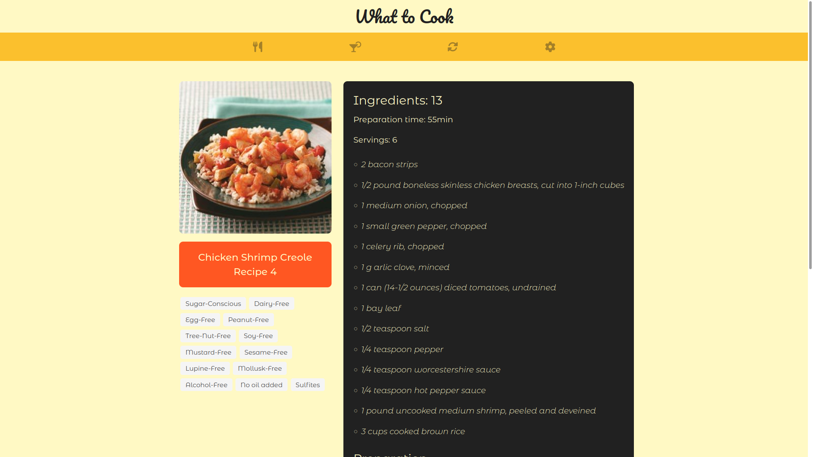
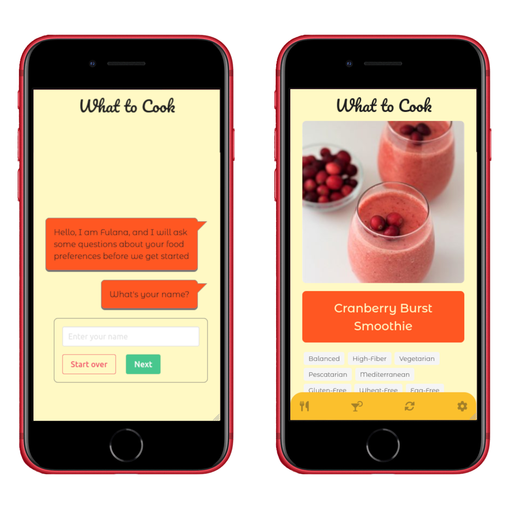

# :fork_and_knife: What to Cook :cocktail:

## :page_with_curl: About

HTML, CSS, and JavaScript group project developed by [Laís Namatela](https://www.linkedin.com/in/la%C3%ADs-nametala/), [Raphael Martins](https://www.linkedin.com/in/raphaelameidamartins/), [Rafael Oliveira Elias](https://www.linkedin.com/in/rafael-oliveira-elias-865bb3154/) and [Wendryo Sales](https://www.linkedin.com/in/wendryosales/) at the end of [Principles of Web Development Module](https://github.com/raphaelalmeidamartins/trybe_exercicios/tree/main/1_fundamentos-do-desv-web) of Trybe's Web Development course.

We developed a random recipe suggestions web app fetching for recipes data from the Edman's API. We also implemented a chat-bot to set user preferences.

[Click here](https://raphaelalmeidamartins.github.io/what-to-cook-web-app) to check out the final version of the project on your browser.

## :man_technologist: Developed Skills

* Create a brand new project from scratch using all the content we learned during the module
* Use a public API to fetch data
* Create and test the asynchronous functions using TDD
* Manipulate HTML elements with the DOM API
* React to user interations by using event listeners
* Implement a responsive design with CSS flexbox and media queries
* The project was non-evaluative

## :memo: Methodologies

* Mobile First
* Test Driven Development (TDD)
* Pair programming

## :hammer_and_wrench: Tools

* HTML5
* CSS3
* JavaScript ES6+
* Jest
* Bulma
* Font Awesome (icon library)

## :iphone: Mobile version

### :copyright: Copyright disclaimer

We developed this project for learning purposes, all the code and documentation texts are our authorship, and the rights belong exclusively to us. It is allowed to download or clone the repository for study purposes. However, it is not allowed to publish full or partial copies. This disclaimer does not cover libraries and dependencies, which are subject to their respective licenses.

We use the Edaman API to fetch the recipes' data.

